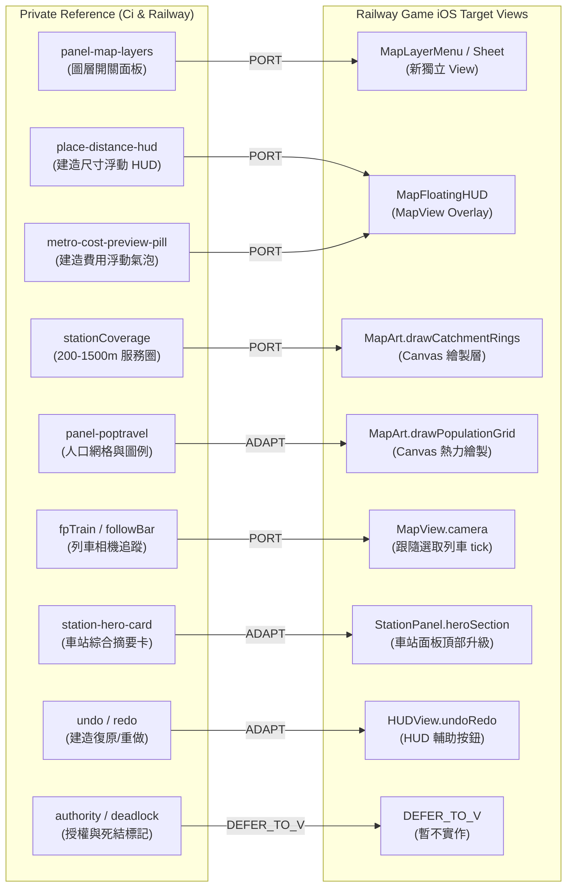

# Railway Game — Current UI Gap & Private Reference Port Plan

> **文件狀態**：完整規格與移植計畫書（唯讀研究，無任何程式碼修改）  
> **基準版本**：
> - `railway-game-ios` `main` 分支（Commit: [`9454d12`](https://github.com/a91453/railway-game-ios/commit/9454d122c8273c60d91cccf5e1c63481d113eafb)）
> - 私有參考資料夾：`railway-reference-private/`（`Railway/site_archive_clean`、`Railway/taipei_gta_reference`、`Ci/reference_snapshot`）  
> **排除邊界**：全面排除 V 系列（V1–V4e 及後續 Dispatcher / 待避 / 死結 / 授權標示），標記為 `DEFER_TO_V`、`DEFER_DATA_MODEL`、`DEFER_DATA_PIPELINE`。

---

## 1. Current UI Summary（目前 main 介面現況）

目前 GitHub `main` 分支（截至 PR #127 合併後）已具備一套針對 iOS / iPadOS 設計的 SwiftUI + Canvas 輕量化介面：

1. **主畫面佈局 ([`ContentView.swift`](../../RailwayGameApp/Views/ContentView.swift))**：
   - 直向（iPhone / iPad Portrait）：頂部 `HUDView`，中間為固定比例的 `MapView`（iPhone 占 50% 高度，iPad 占 4:3 比例），下方為可捲動的 `ControlPanel`。
   - 橫向（Wide / iPad Landscape）：左側全螢幕 `MapView`，右側為固定寬度 360pt 的 Sidebar 放置 `HUDView`、`ControlPanel` 與 `NetworkOverview`。
2. **頂部 HUD ([`HUDView.swift`](../../RailwayGameApp/Views/HUDView.swift))**：
   - 資金餘額按鈕（點選彈出 `EconomyPanel` Sheet）。
   - 遊戲時鐘與日期顯示。
   - 線路按鈕（點選彈出 `LinesPanel` Sheet）。
   - 速度與暫停控制（`SpeedControl`：暫停/繼續、倍速選單）。
   - 主選單（`gameMenu`：手動存檔、匯出存檔、重開教學、回到主畫面）。
3. **地圖與畫布 ([`MapView.swift`](../../RailwayGameApp/Views/MapView.swift)、[`MapArt.swift`](../../RailwayGameApp/Views/MapArt.swift)、[`AppleMapBackground.swift`](../../RailwayGameApp/Views/AppleMapBackground.swift))**：
   - 自訂 `MapCanvas` 繪製地皮、鐵軌（依平面/高架/橋樑/隧道繪製不同樣式）、月台、車站圓點標記、列車車身與前進箭頭、建造預覽。
   - 支援手勢平移與雙指縮放，右下角提供浮動放大/縮小按鈕。
   - 實景模式下底部嵌入 Apple MapKit（提供標準/衛星/混合三種樣式）並疊加真實台鐵/捷運路線淡色幾何。
4. **控制面板 ([`ControlPanel.swift`](../../RailwayGameApp/Views/ControlPanel.swift))**：
   - 工具切換列（`ToolPicker`）：選擇 (`.select`)、路網建造 (`.network`)、列車管理 (`.train`)。
   - 選取檢查器（`InspectorView`）：顯示當前選取的車站或軌道段。
   - 動態選項區（`ToolOptions`）：
     - 軌道建造選項（[`NetworkControls.swift`](../../RailwayGameApp/Views/NetworkControls.swift)）：結構（地面/高架/橋樑/隧道）、標高 Stepper、平滑曲線與緩和坡度切換、月台建造設定、拆除模式。
     - 列車控制選項（[`TrainControls.swift`](../../RailwayGameApp/Views/TrainControls.swift)）：列車清單、購車按鈕、編組長度、朝向設定、速限 Stepper、反向/下軌/離線指令。
   - 底部主動作按鈕（`ActionButton`）：建造軌道（含費用預覽）、增建月台、拆除軌道、放置/派遣列車。
5. **次級資訊面板（Sheet 彈窗）**：
   - 車站客流面板（[`StationPanel.swift`](../../RailwayGameApp/Views/StationPanel.swift)）：客流類型設定（住宅/辦公/商業/景區）、日客流量 Stepper、進出站 24 小時長條圖、OD 站對需求、候車隊列與結算清單。
   - 營運線路面板（[`LinesPanel.swift`](../../RailwayGameApp/Views/LinesPanel.swift)）：全日運行時段帶（尖峰/離峰/低峰）、線路清單、起訖停站順序調整、配車數與目標班距、短途/快車 Pattern、V4b 實體路徑選單。
   - 經濟財務面板（[`EconomyPanel.swift`](../../RailwayGameApp/Views/EconomyPanel.swift)）：帳戶餘額、模式切換（自由/經營）、單一票價設定、最近一小時流水、週期財務報表（日/週/月/年）、會計分類帳。
   - 時刻表編輯器（[`TimetableEditor.swift`](../../RailwayGameApp/Views/TimetableEditor.swift)）：個別列車固定時刻表編輯。
   - 教學引導（[`TutorialOverlay.swift`](../../RailwayGameApp/Views/TutorialOverlay.swift)）：步驟卡片高亮目標引導。

---

## 2. Missing UI Now（現在可以加入、不屬於 V 系列的缺口）

以下列出私有參考中具備成熟實作、目前 main 完全缺失、且**不需要等待 V 系列**即可獨立實作的 UI 項目：

| UI 名稱 | Main 現況 | Reference 來源 | 處理方式 | 為什麼值得加入 | 是否需要新 Backend 能力 | 優先度 |
| :--- | :--- | :--- | :--- | :--- | :--- | :--- |
| **地圖資訊圖層選擇器 (Map Layer Panel)** | `MISSING`<br>(目前僅有實景地圖底圖選單，無法開關覆蓋圖層) | `Ci/`：`#panel-map-layers`<br>`layer-toggle-*` | **PORT** | 玩家無法開關站名、候車人數、列車、軌道細節、人口網格，地圖容易雜亂或資訊不足。現代經營遊戲核心控制項。 | 否（僅控制 `MapArt` 與 Canvas 既有繪製旗標） | **P0** |
| **建造軌道浮動數據 HUD (Track Floating HUD)** | `MISSING`<br>(數值被埋在下方可捲動面板，玩家手指遮住視線且要低頭看) | `Ci/`：`.place-distance-hud`<br>`.metro-cost-preview-pill` | **PORT** | 手指拖曳拉軌時，直接在畫布拖曳點旁以浮動氣泡顯示長度 (m)、曲率半徑 (m)、坡度 (%) 與即時費用，大幅提升觸控建造手感。 | 否（`GameSession.networkPreview` 已經有完整數值） | **P0** |
| **建造動作復原/重做 (Undo / Redo HUD Buttons)** | `MISSING`<br>(蓋錯軌道只能手動切換到 remove 模式點選刪除並賠錢) | `Ci/`：頂部工具列復原/重做機制與快捷鍵 | **ADAPT** | 行動裝置觸控誤觸率高，蓋錯軌道缺乏即時 Undo 嚴重影響建造心流。可在 Presentation 層保留最後一次指令快照。 | 否（Presentation 層封裝指令逆向或調用 `GameWorld` 既有拆除/退款指令） | **P0** |
| **車站服務半徑 / 影響範圍圓圈 (Station Catchment Overlay)** | `MISSING`<br>(後端已計算 800m 人口，地圖上卻完全不畫圓) | `Ci/`：`stationCoverage` (200m/500m/800m/1500m 圈) | **PORT** | `PopulationGrid` 已將 800m 定為步行範圍，但在地圖上看不見，玩家不知道新車站涵蓋了哪些區域、是否與鄰站重疊。 | 否（`MapArt` 依車站座標繪製透明同心圓） | **P0** |
| **人口密度網格覆蓋層 (Population Heatmap / Grid Overlay)** | `MISSING`<br>(檔案已打包 `taiwan_population.json`，但畫布完全無呈現) | `Ci/`：`#panel-poptravel`<br>`legend-poptravel-population`<br>`map.population.gridTitle` | **ADAPT** | 玩家在實景大地圖上不知道哪裡人口密集、哪裡該設站。將已載入的 `PopulationGrid` 繪製為可開關的彩色方格/熱力層。 | 否（`PopulationGrid` 資料已在記憶體中，僅需 Canvas 繪圖） | **P1** |
| **列車視角追蹤跟隨 (Train Follow Camera)** | `MISSING`<br>(選取列車不會跟隨，列車開出螢幕就看不見) | `Railway/`：`#followBar` / `#followPanel` (`fpTrain`)<br>`Ci/`：`metro.train.follow` | **PORT** | 鐵路模擬遊戲最重要的觀賞與沉浸體驗。點選列車後相機自動鎖定該列車座標平移，再次拖曳地圖自動解除。 | 否（`PlanCamera.centered(on:)` 既有能力，僅需綁定 tick 驅動） | **P1** |
| **全列車營運總覽表 (Train Fleet Roster)** | `MISSING`<br>(只能在 `TrainControls` 的下拉選單一台一台翻) | `Ci/`：`#panel-train` 列表模式<br>`Railway/`：`#recordBar` | **ADAPT** | 當車輛數達到 10 台以上時，下拉選單無法比較各車狀態。需要全車隊列表（顯示車名、路線、滿載率、準點狀態、當前狀態）。 | 否（直接讀取 `session.world.trains`） | **P1** |
| **線路識別配色選擇器 (Line Color Picker)** | `MISSING`<br>(目前顏色依 Line ID 取餘數寫死 6 色，無法自訂) | `Ci/`：`line-info-badge` 與線路顏色色盤 | **ADAPT** | 路線經營的個人化核心體驗，允許玩家為每條路線指定捷運/台鐵代表色（紅/藍/綠/橘/黃/紫等 16 色）。 | 否（可存於 `Presentation` 或利用既有屬性擴充） | **P2** |
| **車站更名與等級標籤 (Station Rename & Tier Badge)** | `MISSING`<br>(只能在初次建站時輸入名稱，建好後無法修改) | `Ci/`：`station.name.edit`<br>`Railway/`：`tra_station_class.json` | **PORT** | 蓋錯站名無法修改體驗極差；結合真實車站資料等級（特等/一等/二等/三等/簡易）顯示徽章。 | 否（`GameWorld.renameStation` 既有指令） | **P2** |
| **獨立拆除推土機工具 (Bulldozer / Demolish Mode)** | `MISSING`<br>(藏在 Network -> SegmentedPicker 的第三項) | `Ci/`：底部工具列專用刪除按鈕 (`bb-tool-btn`) | **ADAPT** | 將拆除提升為工具列顯著模式或快捷按鈕，避免在選單中頻繁切換。 | 否（呼叫既有 `removeNetworkEdge`） | **P2** |

---

## 3. Existing UI That Should Be Improved（現有 UI 需改善項目）

| 現有檔案 / View | 現在的問題 | Reference 的優點 | 建議調整方向 | PORT / ADAPT |
| :--- | :--- | :--- | :--- | :--- |
| [`ContentView.swift`](../../RailwayGameApp/Views/ContentView.swift)<br>(iPhone Portrait 佈局) | iPhone 直向螢幕被死板地對半切（地圖固定 50%，控制台占 50%），地圖可視範圍極為侷促，操控體驗像桌面軟體而非現代手遊。 | `Ci/` 與現代地圖 App 採用**全螢幕地圖 + 浮動膠囊 HUD + 底部抽屜 (Interactive Bottom Sheet / Drawer)**。 | 將 iPhone 地圖改為滿版 (100%)，控制台改用可折疊的浮動卡片/BottomSheet，支援最小化（僅工具列）、半開（檢查器）與全開（詳細設定）。 | **ADAPT** |
| [`StationPanel.swift`](../../RailwayGameApp/Views/StationPanel.swift)<br>(車站資訊面板) | 1. 完全不顯示該站所屬路線與行經班次。<br>2. 後端明明有 800m 人口計算，面板卻只顯示計算後的 `dailyTrips`，看不到腹地常住人口數。<br>3. 樣式偏向原生 iOS Settings 表單，缺乏遊戲卡片精緻度。 | `Ci/` 的 `station-hero-card` 與 `station-header-lines`：頂部有大站名、路線彩色圓標（如 BL / R）、周邊人口統計、轉乘路線列表。 | 頂部改為 Hero Card，列出停靠線路標籤、800m 腹地人口估算、車站等級徽章，下方保留既有的 24 小時長條圖與 OD 站對。 | **ADAPT** |
| [`TrainControls.swift`](../../RailwayGameApp/Views/TrainControls.swift)<br>(列車資訊與控制) | 列車滿載狀態僅以純文字 `Label("Load 140 / 320", ...)` 顯示，缺乏直觀警示；行駛進度與車廂編組缺少視覺化。 | `Ci/` 的 `trainCard` 與 `metro.train.load_factor`：具備進度條式滿載率色條（綠 <70%、黃 70-90%、紅 >90%）與車廂編組小圖。 | 在狀態卡片中增加彩色滿載率進度條（`ProgressView`）及車廂編組示意圖卡片，並提供一鍵「相機跟隨」按鈕。 | **PORT** |
| [`LinesPanel.swift`](../../RailwayGameApp/Views/LinesPanel.swift)<br>(路線管理面板) | 路線停站順序以純文字清單顯示，視覺上無法一目了然看出路線走勢、折返點與區間交路覆蓋範圍。 | `Ci/` 的 `metro-diagram-toolbar` 與帶連線的站點條狀圖（Metro Line Strip）。 | 改良停靠站列表，左側加上彩色路線豎線與車站端點空心/實心圓點，直觀表達起訖站與中途停站。 | **ADAPT** |
| [`InspectorView.swift`](../../RailwayGameApp/Views/InspectorView.swift)<br>(選取檢查器) | 點選空地或軌道時資訊過於簡陋（僅顯示坐標或 "Tap a station..."），在建造模式下佔據版面。 | `Ci/` 的 Contextual Inspector：選取軌道顯示長度/速限/通過列車，選取車站顯示摘要快速按鈕。 | 精簡選取提示，若點選軌道邊顯示軌道邊長度與速限；若選取車站顯示快顯卡片與客流按鈕。 | **ADAPT** |

---

## 4. Reference UI That Must Wait（必須等待 V 系列的項目：`DEFER_TO_V`）

依據第一原則，以下 private reference 中的介面與功能**嚴格禁止在現階段加入或偽裝實作**，必須等待對應的 V 階段完成：

| UI / 功能名稱 | Reference 來源 | 為什麼現在不能做 | 依賴的 V 系列能力 / 原因 | 標記狀態 |
| :--- | :--- | :--- | :--- | :--- |
| **地圖移動授權範圍標示 (Movement Authority Overlay)** | `Ci/`：`rail-authority-lane`<br>`Railway/`：`movement-authority` | 顯示列車當前鎖定與授權前進的實體軌道段區間。 | 依賴 **Stage V4e**（授權範圍與死結圖示）。目前 GameCore 尚未完成 V4e 的地圖授權渲染合約。 | `DEFER_TO_V` |
| **死結列車警示與地圖標記 (Deadlock Visual Alerts)** | `Ci/`：`deadlock-badge`<br>`RailwayCore`：`deadlock-marker` | 在地圖上閃爍標記互相卡死的兩台列車與阻擋節點。 | 依賴 **Stage V4e** 與 V2 視覺化對接。 | `DEFER_TO_V` |
| **單線交會/待避預排時刻視圖 (Scheduled Meets Gantt Chart)** | `Railway/`：`inferMeetPassTimes`<br>`index.html` 待避圖 | 顯示慢車在特定側線等待快車通過的排程甘特圖。 | 依賴 **Stage V3 / V4a** 的排定交會與待避完全穩定，不能在 UI 上硬造假排程。 | `DEFER_TO_V` |
| **中途折返與側線調度介面 (Turnback / Siding UI)** | `Railway/`：`turnbacks.js`<br>`Ci/`：`shortTurn` | 在路線中途讓列車換向倒退進側線待命的控制介面。 | 依賴 **Stage V4d**（中途換向與倒進側線）。目前 GameCore 無法處理反向折返運動。 | `DEFER_TO_V` |
| **進路信號燈與聯鎖控制 (Signal & Interlocking UI)** | `Railway/`：`signals.js`<br>`Ci/`：`block-signals` | 號誌機擺設與閉塞分區手動控制面板。 | 屬於 V 系列後續或獨立 Signal Phase，GameCore 目前為空間節點與預約制。 | `DEFER_TO_V` |
| **動態人口成長/衰退統計 (Dynamic Population Growth)** | `Ci/`：`metroWeeklyDemand`<br>`poptravel-tab-move` | 鐵路通車後周邊人口隨年齡/就業動態遷移與成長曲線。 | 依賴人口動態演化模型（目前為靜態 1km 網格）。 | `DEFER_DATA_MODEL` |
| **真實 3D 建築輪廓與 GIS 載入 (3D Building Footprints Ingestion)** | `Ci/`：`mdBuildings`, `hkBuildings`<br>`Railway/`：`historic-buildings-v2` | 在地圖上即時下載並擠出數萬棟 OSM / Overture 3D 建築。 | 依賴向量圖磚管線與龐大 GIS 資料流。 | `DEFER_DATA_PIPELINE` |

---

## 5. UI Port Map（移植對照地圖）

本表列出從私有參考到 Railway Game iOS 畫面的直接映射關係：



### 詳細元件對照表

| Reference UI / Component | Railway Game 目標畫面 | 判定 | 預計修改/新增的 Swift 模組 |
| :--- | :--- | :--- | :--- |
| `panel-map-layers` (底圖、車站名、候車人數、圖層開關) | 地圖畫布浮動圖層按鈕與彈出選單 | **PORT** | 新增 `RailwayGameApp/Views/MapLayerSheet.swift`<br>修改 `MapView.swift` |
| `place-distance-hud` + `metro-cost-preview-pill` | 軌道建造拖曳時的螢幕浮動測量氣泡 | **PORT** | 新增 `RailwayGameApp/Views/MapConstructionHUD.swift`<br>修改 `MapView.swift` |
| `stationCoverage` (服務範圍圈) | 地圖車站 800m / 500m 半透明覆蓋圓圈 | **PORT** | 修改 `RailwayGameApp/Views/MapArt.swift`<br>讀取 `StationDemand.catchmentRadius` |
| `panel-poptravel` (人口分佈、顏色圖例、透明度滑桿) | 人口熱力覆蓋圖層與圖例卡片 | **ADAPT** | 修改 `MapArt.swift`（支援 `drawPopulationGrid`）<br>新增 `PopulationLegendView.swift` |
| `fpTrain` / `followBar` (列車跟隨) | 點擊列車後的相機動態鎖定 | **PORT** | 修改 `GameSession.swift`（增加 `isFollowingTrain`）<br>修改 `MapView.swift` |
| `station-hero-card` + `station-header-lines` | 車站面板頂部卡片（停靠路線、腹地人口、等級徽章） | **ADAPT** | 修改 `RailwayGameApp/Views/StationPanel.swift` |
| 建造歷史與 Undo / Redo | HUD 頂部或底部的復原/重做按鈕 | **ADAPT** | 修改 `GameSession.swift`<br>修改 `HUDView.swift` |
| 路線顏色自訂與圓形標章 | 線路編輯面板中的顏色選擇器 | **ADAPT** | 修改 `RailwayGameApp/Views/LinesPanel.swift` |
| 3D 建築擠出與 GIS 屬性查詢 | 地圖建築圖層與區塊點選 | **DEFER_DATA_PIPELINE** | 需向量圖磚資料管線，現階段不排入 |
| 移動授權 (Movement Authority) | 軌道鎖定綠色/黃色高亮 | **DEFER_TO_V** | 依賴 Stage V4e |
| 死結標示 (Deadlock Markers) | 地圖紅色驚嘆號閃爍標記 | **DEFER_TO_V** | 依賴 Stage V4e |

---

## 6. Recommended Implementation Order（非 V 部分推薦實作順序）

本排序嚴格遵循：「先補主遊戲操作最明顯缺失 → 再改善資訊呈現 → 再處理外觀與 Polish」原則，且**完全不觸碰任何 V 系列程式碼**：

```
[Phase 1: P0 - 建造與地圖基礎操控缺口]
  ├─ 1.1 MapConstructionHUD (浮動長度/半徑/坡度/費用氣泡)
  ├─ 1.2 MapLayerSheet (圖層開關：站名、候車數、服務圈)
  ├─ 1.3 Station Catchment Rings (地圖繪製 800m 步行圈)
  └─ 1.4 Construction Undo (基礎軌道建造復原支援)

[Phase 2: P1 - 人口可視化與營運資訊增強]
  ├─ 2.1 Population Grid Canvas Layer (WorldPop 人口彩色方格覆蓋層)
  ├─ 2.2 StationPanel Catchment Info (車站面板顯示 800m 人口數與等級)
  ├─ 2.3 Train Follow Camera (相機平滑跟隨列車)
  └─ 2.4 Train Occupancy Progress Bar (列車載客率色彩警示條)

[Phase 3: P2 - 佈局適配與體驗 Polish]
  ├─ 3.1 iPhone Adaptive Drawer (iPhone 滿版地圖 + 抽屜式控制台)
  ├─ 3.2 Station Rename UI (車站面板支援直接重新命名)
  ├─ 3.3 Line Color Picker (線路面板支援 16 色自訂)
  └─ 3.4 Dedicated Bulldozer Tool (直覺拆除模式切換)
```

### 優先度定義

- **P0（最高優先，主遊戲體驗關鍵缺陷）**：
  1. **建造浮動 HUD**：大幅消除觸控盲操感。
  2. **圖層選擇器**：解鎖被隱藏的地圖維度。
  3. **車站 800m 服務圈繪製**：讓人口系統第一次在畫布上「被看見」。
  4. **建造 Undo**：解決誤觸造成不可逆損失的挫折感。
- **P1（次高優先，核心經營資訊可視化）**：
  1. **人口方格熱力層**：讓選址設站具備真正的策略依據。
  2. **車站腹地人口摘要**：將 WorldPop 數據具體呈現給玩家。
  3. **相機跟隨列車**：大幅強化遊戲觀賞樂趣。
  4. **列車滿載率色彩警示**：直觀診斷路線擁擠度。
- **P2（優化與 Polish）**：
  1. **iPhone 抽屜式佈局**：解放 iPhone 螢幕空間。
  2. **車站自訂命名**與**線路顏色挑選**。
  3. **獨立推土機工具列按鈕**。

---

## 7. Population UI Gap（人口系統深度盤點）

### A. 人口指標現況矩陣

| 人口指標 / 功能 | 目前 Main 現況 | Reference 來源 | 處理建議 | 說明與邊界 |
| :--- | :--- | :--- | :--- | :--- |
| **全島/總人口數 (Total Population)** | `EXISTS` (資料層)<br>`MISSING` (UI 層) | `Ci/`：`panel-poptravel`<br>`total` 人數計數器 | **PORT** | `PopulationGrid.total` 已有 23,858,946 人，但 HUD / 任何面板都未顯示。可在 `NetworkOverview` 或 `MapLayerSheet` 中顯示。 |
| **車站服務腹地人口 (Station Catchment Population)** | `PARTIAL`<br>(後端計算完轉為 dailyTrips，UI 上隱藏原始人口) | `Ci/`：`station.residentPopulation`<br>`map.overlay.tooltip.residentPopulation` | **PORT** | `PopulationGrid.people(within: 800, ...)` 運算已完備。只需在 `StationPanel` 頂部新增「800m 範圍常住人口：約 X 萬人」文字。 |
| **車站服務圈可視化 (Catchment Overlay)** | `MISSING` | `Ci/`：`stationCoverage`<br>(200m / 500m / 1000m / 1500m) | **PORT** | 在 `MapArt.swift` 中以 `Palette.station` 繪製半透明 800m 圓形。支援重疊度觀察。 |
| **人口密度覆蓋圖層 (Population Heatmap / Grid)** | `MISSING` | `Ci/`：`panel-poptravel`<br>LandScan 300m / 1km 方格 | **ADAPT** | 在 `MapArt` 增加畫布圖層：將 `taiwan_population.json` 的非零格子映射為淺藍到深紅的半透明方格。 |
| **人口與客流圖例 (Legend & Scale Bar)** | `MISSING` | `Ci/`：`poptravel-legend-bar`<br>`poptravel-legend-swatch` | **PORT** | 搭配熱力層在畫布角落或 Sheet 中顯示色階標籤（0 → 1k → 5k → 10k+ 人/km²）。 |
| **區域/行政區人口 (District Population)** | `MISSING` | `Ci/`：`mdDistricts` / `hkDistricts` | `DEFER_DATA_PIPELINE` | 需要鄉鎮市區邊界 GeoJSON（目前 repo 僅有全島 raster，無向量行政邊界）。 |
| **人口隨鐵路通車動態演化 (Dynamic Growth / Accessibility)** | `MISSING` | `Ci/`：`metroWeeklyDemand`<br>`poptravel-tab-move` | `DEFER_DATA_MODEL`<br>`DEFER_TO_V` | 目前 `PopulationGrid` 為靜態 WorldPop 資料，GameCore 尚未實作動態土地增值或人口遷移模型。 |

---

## 8. Real-World Urban Blocks UI Gap（真實城市區塊盤點）

### A. 幾何範式轉換：Grid-Centric → Free-Coordinate Urban Geometry

> [!IMPORTANT]
> 早期參考（如舊版 Web 或網格版原型）採用固定 16m / 32m 正方形格子（Tile Grid）。  
> **Railway Game iOS 目前全面採用自由坐標、自由轉角鐵路網（Free-Coordinate Network）**。  
> 任何真實街區、地塊與道路的參考設計，**絕對不可退回遊戲邏輯網格**，必須以真實世界幾何（Polygons / Polylines）方式映射至自由坐標空間。

### B. 真實區塊功能判斷矩陣

| 區塊與城市結構功能 | 目前 Main 現況 | Reference 來源 | 處理建議 | 依賴與原因 |
| :--- | :--- | :--- | :--- | :--- |
| **底圖街道與真實地理背景** | `EXISTS`<br>(Apple MapKit 靜態襯底) | `Ci/`：Positron / OSM<br>`Railway/`：Esri Basemap | **EXISTS** | 目前 `AppleMapBackground.swift` 已穩定運作，能提供真實街道與標籤。 |
| **真實鐵路路網淡色疊加** | `EXISTS` | `Railway/`：`track_lines.geojson`<br>`track_stations.geojson` | **EXISTS** | `RealRailways.swift` 已在 MapKit 上繪製台鐵與捷運參考線形。 |
| **街區與地塊點選 (Block Tap Selection)** | `MISSING` | `Ci/`：`map.overlay.tooltip.buildingAndLand` | `DEFER_DATA_PIPELINE` | 需要地塊向量圖資（Parcels GeoJSON / Vector Tiles）。目前 repo 無地塊多邊形資料。 |
| **建築物輪廓與用地性質 (Building Footprints & Zoning)** | `MISSING` | `Ci/`：`sgLand.residential` / `nonResidential`<br>`mdBuildings` | `DEFER_DATA_PIPELINE` | 需要台灣全島建築多邊形（OSM / Overture Buildings）。資料量達數百 MB，需專門圖磚伺服器或精簡包。 |
| **地塊資訊卡片外殼 (Block Inspector Shell)** | `MISSING` | `Ci/`：Tooltip 卡片（面積、用途類別、最近車站距離） | **ADAPT (Shell Only)** | 可先設計唯讀的 `BlockInspectorView` 介面結構，在點選 Apple 地圖 POI 或座標時顯示經緯度與周邊 800m 估算人口。 |
| **土地利用概略分類圖層 (Zoning-like Visualization)** | `MISSING` | `Ci/`：OSM 住宅區 vs 商業區 | `DEFER_DATA_PIPELINE` | 依賴土地使用分區資料庫。 |

---

## 9. Population × Real Blocks Integration（未來 UI 關係整合）

未來當人口動態模型與真實街區向量管線就緒後，在 UI 上的理想資訊階層架構應為：

```
[真實地理層 Real World Geometry]
      │
      ▼
[城市街區/地塊 Urban Block / Parcel]
      │  ├─ 面積 (Area)
      │  ├─ 土地利用屬性 (Zoning: 住宅 / 商業 / 工業 / 設施)
      │  └─ 建築輪廓 (Building Footprints)
      │
      ▼
[人口與就業分佈 Population & Density (PopulationGrid)]
      │  ├─ 常住人口 (Residents)
      │  ├─ 就業/活動人口 (Employment / Visitors)
      │  └─ 人口密度色階 (Heatmap Cell)
      │
      ▼
[鐵路可達性與影響圈 Railway Accessibility & Station Catchment]
      │  ├─ 核心步行圈 (200m / 500m)
      │  ├─ 主力覆蓋圈 (800m - 約 10 分鐘步行)
      │  └─ 鄰近車站距離 (Distance to nearest Station)
      │
      ▼
[乘車需求與潛力 Trips Demand & Growth]
      │  ├─ 潛在日旅次 (Daily Trips Generated)
      │  └─ 尖離峰分佈 (Peak / Off-Peak Split)
```

### UI 互動呈現定義：
1. **地圖層級（Global Overlay）**：
   - 透過 `MapLayerSheet` 可獨立勾選：
     - `[v] 800m 車站服務圈`（同心圓半透明高亮，重疊處顏色加深）
     - `[v] 人口分佈網格`（以 1km 方格呈現密度梯度）
2. **微觀檢查器層級（Inspector Level）**：
   - 當玩家點選車站時，`StationPanel` 顯示：
     - **服務腹地人口**：`\(catchmentPopulation)` 人（涵蓋半徑 800m 範圍）。
     - **預估轉換率**：每百人每日 40 旅次。
     - **預期日客流**：`\(dailyTrips)` 旅次/日。

---

## 10. Claude Code / Codex Handoff（後續實作委派規格）

本節為交接給下一個 Coding Agent（Claude Code 或 Codex）的執行指令規格，**可直接作為 Prompt 輸入**。

### A. 實作任務清單

#### Task 1: 新增地圖資訊圖層控制列 (`MapLayerSheet.swift` & `MapView.swift`)
- **檔案**：
  - 新增：[`RailwayGameApp/Views/MapLayerSheet.swift`](../../RailwayGameApp/Views/MapLayerSheet.swift)
  - 修改：[`RailwayGameApp/Views/MapView.swift`](../../RailwayGameApp/Views/MapView.swift)
- **Reference 來源**：`Ci/reference_snapshot/lib/game-dom__q_f4c03f23b8518a04.html` 的 `#panel-map-layers`。
- **作法**：
  - 在 `MapView` 頂部或底部操作列加入圖層按鈕（SF Symbol: `square.3.layers.3d`）。
  - 彈出選單支援開關：
    - `showsStationNames`: 是否顯示站名文字。
    - `showsCatchmentRings`: 是否顯示車站 800m 影響範圍圓圈。
    - `showsPopulationGrid`: 是否顯示人口網格熱力圖。
    - `showsWaitingCounts`: 是否顯示候車人數標記。

#### Task 2: 繪製車站 800m 服務範圍圈 (`MapArt.swift`)
- **檔案**：
  - 修改：[`RailwayGameApp/Views/MapArt.swift`](../../RailwayGameApp/Views/MapArt.swift)
- **Reference 來源**：`Ci/` `stationCoverage` 與 `StationDemand.catchmentRadius` (800.0m)。
- **作法**：
  - 在 `MapArt.drawPointStation` 或獨立的 `drawStationCatchment` 函數中，以車站坐標為圓心，`800.0` 公尺為半徑（透過 `projection.pointsPerUnit` 換算為螢幕像素），繪製淺藍色半透明填充圓（`Palette.station.opacity(0.12)`）與細描邊。

#### Task 3: 建造軌道浮動數據與費用氣泡 (`MapConstructionHUD.swift`)
- **檔案**：
  - 新增：[`RailwayGameApp/Views/MapConstructionHUD.swift`](../../RailwayGameApp/Views/MapConstructionHUD.swift)
  - 修改：[`RailwayGameApp/Views/MapView.swift`](../../RailwayGameApp/Views/MapView.swift)
- **Reference 來源**：`Ci/` `.place-distance-hud` 與 `.metro-cost-preview-pill`。
- **作法**：
  - 當 `session.tool == .network` 且 `session.networkPreview != nil` 時，在畫布頂部或端點旁浮動顯示膠囊卡片：
    - 軌道長度、最小半徑、最大坡度。
    - 建造預算費用（例如：`$1,200`）。
    - 若有衝突（`problem != nil`），膠囊變為警告色（`Palette.metroAmber`）。

#### Task 4: 車站資訊面板顯示 800m 腹地人口 (`StationPanel.swift`)
- **檔案**：
  - 修改：[`RailwayGameApp/Views/StationPanel.swift`](../../RailwayGameApp/Views/StationPanel.swift)
- **Reference 來源**：`Ci/` `station-hero-card` 與 `Sources/GamePresentation/PopulationGrid.swift`。
- **作法**：
  - 在 `demandSection` 頂部加入常住人口估算列。
  - 若 `session.population` 存在且為實景地圖，查詢該站坐標 800m 內人數：
    `session.population?.people(within: StationDemand.catchmentRadius, ofLatitude: lat, longitude: lon)`
  - 顯示：「服務腹地人口：約 \(count) 人（800m 步行圈）」。

#### Task 5: 列車相機跟隨模式 (`MapView.swift` & `GameSession.swift`)
- **檔案**：
  - 修改：[`RailwayGameApp/Views/MapView.swift`](../../RailwayGameApp/Views/MapView.swift)
  - 修改：[`Sources/GamePresentation/GameSession.swift`](../../Sources/GamePresentation/GameSession.swift)
- **Reference 來源**：`Railway/` `#followBar` (`fpTrain`)。
- **作法**：
  - 在 `TrainControls` 中選取已放置的列車時，提供「跟隨視角」按鈕。
  - 在每秒更新 tick 時，若處於跟隨狀態，將 `camera` 中心更新至列車當前位置。
  - 若玩家主動觸發地圖拖曳手勢，自動關閉跟隨模式。

### B. V Exclusion Boundary（嚴格禁止項目）

下一個實作 Agent **不可觸碰**：
1. **嚴禁修改任何 GameCore 核心交通/排程代碼**：包括 `ScheduledTraffic.swift`、`Deadlock.swift`、`ScheduledOvertakeTracks.swift`、`LineRoutePreference.swift`、`LineCapacity.swift` 等。
2. **嚴禁變更存檔版本與 Golden Scenario**：不要更動 `SavedGame.swift` 版本號（維持 Version 10），不修改 `GoldenScenarios/`。
3. **嚴禁偽造或提前實作 V 系列功能**：不要在 UI 加上假號誌、假死結排除按鈕、假移動授權區間。
4. **所有 UI 狀態必須限制在 `GamePresentation` 或 `RailwayGameApp` 層級**。

### C. Acceptance Criteria（驗收條件）

1. `swift test` 全數通過，無任何 regression。
2. 在 iPhone 與 iPad 模擬器上執行 `xcodebuild -scheme RailwayGame` 編譯無警告。
3. 建造軌道時，手指在畫布上拖曳可即時看見浮動尺寸與費用 HUD。
4. 開啟圖層選單後，勾選「車站服務圈」可在畫布清晰看到車站 800m 藍色半透明圈，不遮擋鐵軌與列車。
5. 在實景地圖（如台灣或平溪 Demo）點開車站「Ridership」，面板能正確顯示該站 800m 範圍的人口數量。
6. 選取運轉中的列車並啟用跟隨模式，地圖視野平滑跟隨列車前進，手動拖曳地圖能無縫解除鎖定。
